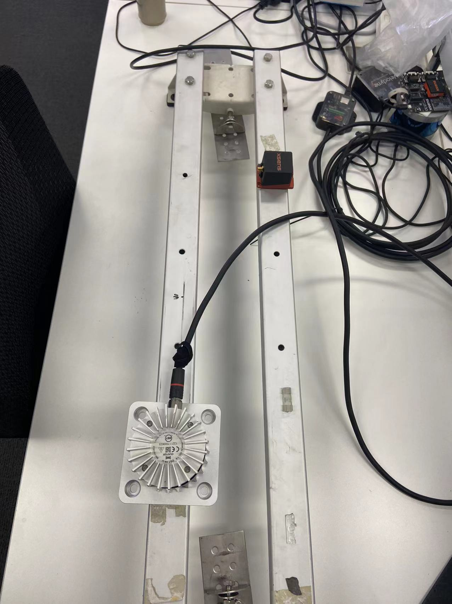

# LI-Calib

## Overview

**LI-Calib** is a toolkit for calibrating the 6DoF rigid transformation and the time offset between a 3D LiDAR and an IMU. It's based on continuous-time batch optimization. IMU-based cost and LiDAR point-to-surfel distance are minimized jointly, which renders the calibration problem well-constrained in general scenarios. 

The following instruction is prepared using ROS1 Melodic in Ubuntu 18.04. For Kinetic and Noetic, it's supposed to modify some compilation config such like Eigen3 version or PCL verison in some CMake files, etc. However, due to unmatched versions of dependencies, some unexpected issues may occur, so it's recommanded to use this tool in Ubuntu 18.04.
 
## **Prerequisites**

- [ROS](http://wiki.ros.org/ROS/Installation) (Melodic)

  Install ros dependencies, replace Melodic with your current ros version.

  ```shell
  sudo apt-get install ros-melodic-pcl-ros ros-melodic-velodyne-msgs
  ```

- [Ceres](http://ceres-solver.org/installation.html) (tested with version 1.14.0)

  The Eigen3 version required by this package may differ from your current one. Just modify the corresponding cmake config.

- [Kontiki](https://github.com/APRIL-ZJU/Kontiki) (Continuous-Time Toolkit)
- Pangolin (for visualization and user interface)
- [ndt_omp](https://github.com/APRIL-ZJU/ndt_omp) 

Note that **Kontiki** and **Pangolin** are included in the *thirdparty* folder.

## Install

Clone the source code for the project and build it.

```shell
# init ROS workspace
source /opt/ros/melodic/setup.bash
cd li_calib/

# ndt_omp
wstool init
wstool merge src/lidar_IMU_calib/depend_pack.rosinstall
wstool update

# Pangolin
cd src/lidar_IMU_calib
./build_submodules.sh

# build
cd ../..
catkin_make
source ./devel/setup.bash
```

## Trouble shooting

During installation, some known issues have been solved.

- Error: conflicting declaration ‘typedef struct LZ4_stream_t LZ4_stream_t'

```shell
sudo mv /usr/include/flann/ext/lz4.h /usr/include/flann/ext/lz4.h.bak
sudo mv /usr/include/flann/ext/lz4hc.h /usr/include/flann/ext/lz4.h.bak
sudo ln -s /usr/include/lz4.h /usr/include/flann/ext/lz4.h
sudo ln -s /usr/include/lz4hc.h /usr/include/flann/ext/lz4hc.h
```

- Error: Could NOT find GLEW

```shell
sudo apt install libglew-dev
```

## Examples

Previously, the LI-Calib toolkit only supports `VLP-16` lidar with msg type `velodyne_msgs/VelodyneScan`. Currently, it has been expanded for general lidar input with msg type `sensor_msgs/PointCloud2` (Tested with ouster-64, the modification ideas will be described as following section). 

Run the calibration:

```shell
./src/lidar_IMU_calib/calib.sh
```

or (if unfamiliar with shell script)

```shell
cd li_calib/
source devel/setup.bash
roslaunch li_calib licalib_gui.launch
```

The options in `calib.sh` the have the following meaning:

- `bag_path` path to the dataset.
- `imu_topic` IMU topic.
- `bag_start` the relative start time of the rosbag [s].
- `bag_durr`  the duration for data association [s].
- `scan4map` the duration for NDT mapping [s].
- `timeOffsetPadding` maximum range in which the timeoffset may change during estimation [s].
- `ndtResolution` resolution for NDT [m].


Follow the steps: 

1. `Initialization`

2. `DataAssociation`

   (The users are encouraged to toggle the `show_lidar_frame` for checking the odometry result. )

3. `BatchOptimization`

4. `Refinement`

6. `Refinement`

7. ...

8. (you cloud try to optimize the time offset by choose `optimize_time_offset` then run `Refinement`)

9. `SaveMap`

All the cache results are saved in the location of the dataset.

**Note that the toolkit is implemented with only one thread, it would response slowly while processing data. Please be patient.** 

## Dataset from developers


Dataset for evaluating LI_Calib are available at [here](https://drive.google.com/drive/folders/1kYLVLMlwchBsjAoNqnrwq2N2Ow5na4VD?usp=sharing). 

We utilize an MCU (stm32f1) to simulate the synchronization Pulse Per Second (PPS) signal. The LiDAR's timestamps are synchronizing to UTC, and each IMU captures the rising edge of the PPS signal and outputs the latest data with a sync signal. Considering the jitter of the internal clock of MCU, the external synchronization method has some error (within a few microseconds).

Each rosbag contains 7 topics:

```
/imu1/data          : sensor_msgs/Imu           
/imu1/data_sync     : sensor_msgs/Imu           
/imu2/data          : sensor_msgs/Imu           
/imu2/data_sync     : sensor_msgs/Imu           
/imu3/data          : sensor_msgs/Imu           
/imu3/data_sync     : sensor_msgs/Imu           
/velodyne_packets   : velodyne_msgs/VelodyneScan
```

`/imu*/data`  are raw data and the timestamps are coincide with the received time. 

`/imu*/data_sync` are the sync data, so do `/velodyne_packets` .

## Dataset from Autocore

Dataset collected by Autocore for validation are available at [here](https://drive.google.com/drive/folders/1aAIQE9QK8KYB62w9fpUtxVeI91matAGQ?usp=sharing).

Ouster and IMU are mounted as shown in:


Here, some tips may be helpful if you want to record your own data:
- For better performance, IMU settings: frequency 400hz, Baudrate: 230400. 
- PTP time sync first for ouster lidar.
- Scenario should contain many surfels (surface element), i.e. ground, wall, roof.
- Large and slow rotation along 3 different axes is expected, this video may help [here](https://www.youtube.com/watch?v=2IX5LVTDkLc).
- Sensors are supposed to be mounted tightly without any relative motion during recording. 
- After calibratiton, Lidar and IMU should be mounted together with fixture on the vehicle, because it's difficult to collect data with roll and pitch movement directly on the vehicle.
- Only two topics required: IMU data (`sensor_msgs/Imu`) and lidar data (`sensor_msgs/PointCloud2` or `velodyne lidar raw scan`). 
- When recording lidar data in msg type `sensor_msgs/PointCloud2`, the height attribute should NOT be set to 1. Otherwise, `pcl::IsNotDenseException` will be thrown.

## Lidar point type expansion

The original project only support velodyne scan as input. Here, I implemented the new feature to take `sensor_msgs/PointCloud2` as input. See details as following:

In ~/src/lidar_IMU_calib/include/utils/pcl_utils.h, I add the following codes:

```shell
namespace licalib {
...
...
struct OusterPointXYZIRT {
    PCL_ADD_POINT4D;
    float intensity;
    uint32_t t;
    uint16_t reflectivity;
    uint8_t ring;
    uint32_t range;
    EIGEN_MAKE_ALIGNED_OPERATOR_NEW
} EIGEN_ALIGN16;
}
```

to define a new struct to store point from ouster lidar, and then 

```shell
POINT_CLOUD_REGISTER_POINT_STRUCT(licalib::OusterPointXYZIRT,
    (float, x, x) (float, y, y) (float, z, z) (float, intensity, intensity)
    (uint32_t, t, t) (uint16_t, reflectivity, reflectivity)
    (uint8_t, ring, ring) (uint32_t, range, range)
)
```

to register above struct as point cloud. After that, we can define our own expanded point type, using

```shell
typedef licalib::OusterPointXYZIRT OPoint;
typedef pcl::PointCloud<OPoint> OPointCloud;
```

In addition, to transform our self defined input, this function `unpack_scan` is supposed to be overwritten. In ~/src/lidar_IMU_calib/include/utils/vlp_common.h

```shell
void unpack_scan(const sensor_msgs::PointCloud2::ConstPtr &lidarMsg,
                   TPointCloud &outPointCloud) const {         
    OPointCloud temp_pc;
    pcl::fromROSMsg(*lidarMsg, temp_pc);

    outPointCloud.clear();
    outPointCloud.header = pcl_conversions::toPCL(lidarMsg->header);
    outPointCloud.height = temp_pc.height;
    outPointCloud.width = temp_pc.width;
    outPointCloud.is_dense = true;
    outPointCloud.resize(outPointCloud.height * outPointCloud.width);

    double timebase = lidarMsg->header.stamp.toSec();
    
    for (int h = 0; h < temp_pc.height; h++) {
      for (int w = 0; w < temp_pc.width; w++) {
        TPoint point;
        point.x = temp_pc.at(w,h).x;
        point.y = temp_pc.at(w,h).y;
        point.z = temp_pc.at(w,h).z;
        point.intensity = temp_pc.at(w,h).intensity;
        point.timestamp = timebase + temp_pc.at(w,h).t * 1e-9; //may be different according to lidar sensor.
        outPointCloud.at(w,h) = point;
      }
    }
  }
```

If necessary, it's not complicated to follow this step to expand any point cloud input as you want.

## Parameter tuning

There are various parameters to be tuned according to scenarios, sensors, etc. In addition to the normal parameters in launch file, the following table may help you from my own experience.

| Location | parameter name |
| --- | --- |
| line 54 in inertial_initializer.cpp | `huber` |
| line 36~41 in lidar_odometry.cpp | `ndt_omp` |
| line 61~63 in calibration.hpp | `global_opt_*_weight` |


## Credits 

This code was developed by the  [APRIL Lab](https://github.com/APRIL-ZJU) in Zhejiang University.

For researchers that have leveraged or compared to this work, please cite the following:

Jiajun Lv, Jinhong Xu, Kewei Hu, Yong Liu, Xingxing Zuo. Targetless Calibration of LiDAR-IMU System Based on Continuous-time Batch Estimation. IROS 2020.  [[arxiv](https://arxiv.org/pdf/2007.14759.pdf)]

## License

The code is provided under the [GNU General Public License v3 (GPL-3)](https://www.gnu.org/licenses/gpl-3.0.txt).
