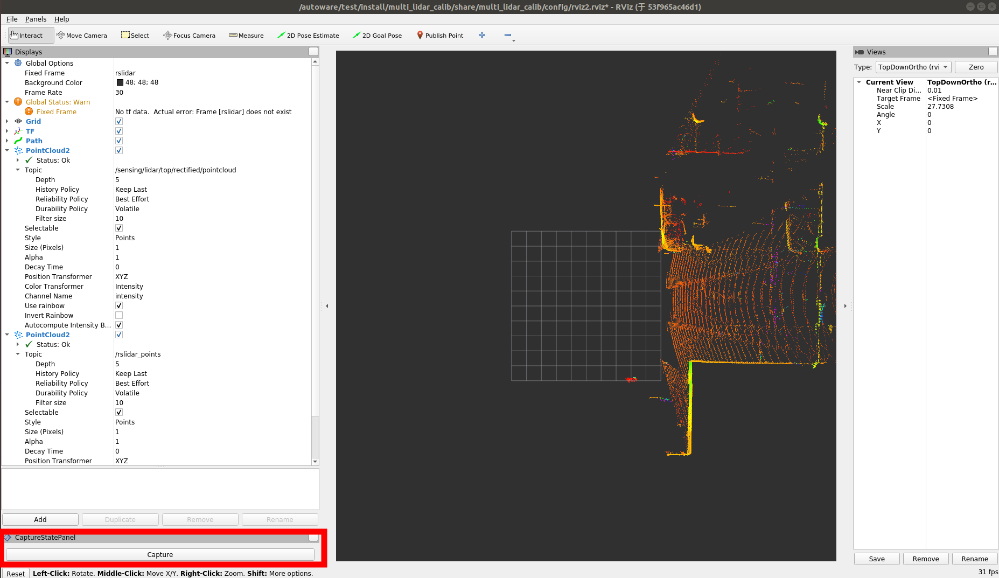
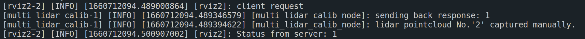
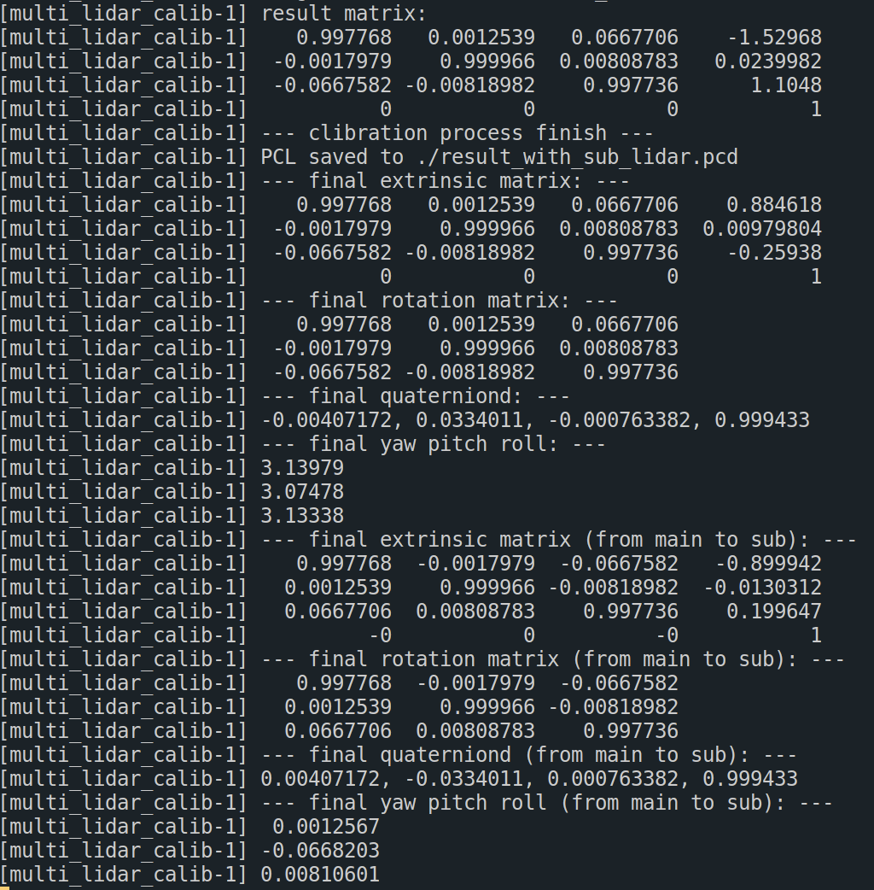
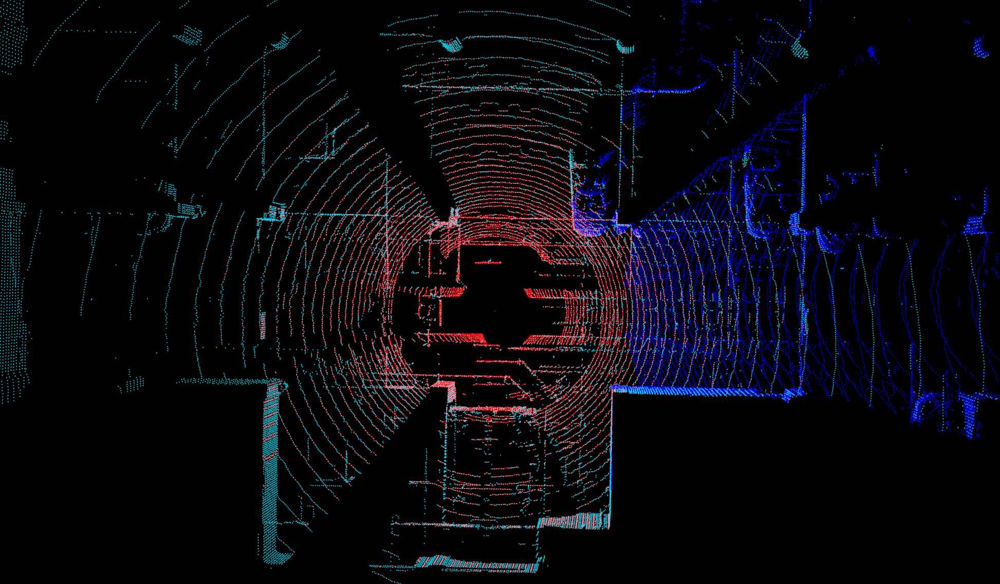
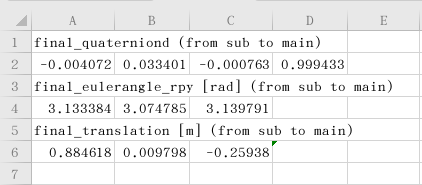

# LL-Calib

## Overview

**LL-Calib** is a ligthweight toolkit for online/offline 3D LiDAR to LiDAR calibration. The fundametal idea of this tool can be described as following:

- concatenate serveral point cloud frames from main LiDAR
- generate a local map
- select one frame of sub LiDAR to match the map
- derive relative localization between sub and main LiDARs based on "fast_gicp" algorithm

To increase point cloud density, the vehicle (LiDAR) should only move slightly (circa 0.5~1 meter) at each time. In addition, the LiDAR data is supposed to be captured only when LiDAR keeps still to avoid motion skew. Hence, the drive-by-wire module is introduced for auto-calibration, or user can manually click capture button in rviz to record data.

## **Prerequisites**

- ROS2

- PCL

- Eigen

- Fast_gicp (included, open sourced at [here](https://github.com/SMRT-AIST/fast_gicp))

- Driving-by-wire module (optional, only for auto-calibration)

## Calibration steps

### 1. Tool installation

Clone the source code of the project and build.

```shell
colcon build --symlink-install --cmake-args -DCMAKE_BUILD_TYPE=Release
```

### 2. Data preparation

Either online or offline calibration is supported, the following 3 ROS2 topics are required for the calibration:

| topic name | msg type |
| ----- | ----- |
| main_lidar_topic | sensor_msgs/msg/PointCloud2 |
| sub_lidar_topic  | sensor_msgs/msg/PointCloud2 |
| velocity_status_topic (optional) | autoware_auto_vehicle_msgs/msg/VelocityReport |

The topic names are configured in the configuration file, please refer to step 3.

A sample dataset is provided for evaluation, please refer to [sample-dateset](#sample-dataset)

### 3. Parameter configuration

Before launching this tool, some parameters in src/multi_lidar_calib/config/params.yaml should be configured as per your need.

| Param name | Description |
| ----- | ----- |
| num_wait_period | For auto-calibration, set as velocity output frequency |
| total_count | how many frames of main LiDAR will be used for mapping |
| save_path | where to save the calibration results |
| file_res | csv file name |
| file_pcd | pcd file name |
| main_lidar_topic | topic name from main LiDAR |
| sub_lidar_topic | topic name from sub LiDAR |
| velocity_status_topic (optional) | velocity info for auto-calibration |
| translation | rough value of translation between two LiDARs for initialization |
| rotation | rough value of rotation between two LiDARs for initialization |

### 4. Calibration

- Start LiDAR drivers first, make sure all the point cloud topics are available.

- (Optional) Start vehicle drive-by-wire driver, make sure the velocity topic is available.

- Launch the calibration tool.  
  source the workspace
  ```shell
  source install/setup.bash
  ```  
  and then
  ```shell
  ros2 launch multi_lidar_calib run.launch.py
  ```

- Main LiDAR data will be captured automated when vehicle velocity is 0, otherwise, user should manually capture it when vehicle stops.

  

  Then you can find some info output in terminal, meaning successfully captured
   
  

- Drive vehicle slightly (circa 0.5~1 meter), and then stop until main LiDAR data is successfully captured.

- Repeat above steps serveral times in accordance with parameter "total_count" configured in src/multi_lidar_calib/config/params.yaml

- Calibration results will be output in terminal and saved under user-definde path.

  

## Sample dataset

Dataset for evaluating this calibration tool is available at [here](https://drive.google.com/drive/folders/1htNyQe1U_XgU15yy96wiGHkBOQLqhvh3).

This bag contains 3 topics:

| topic name | msg type |
| ----- | ----- |
| /rslidar_points | sensor_msgs/msg/PointCloud2 |
| /sensing/lidar/top/rectified/pointcloud | sensor_msgs/msg/PointCloud2 |
| /vehicle/status/velocity_status | autoware_auto_vehicle_msgs/msg/VelocityReport |

The velocity info is used to determine whether LiDAR moves or not. Due to different QoS mechanisms, to play the rosbag, type the following command

```shell
ros2 bag play rosbag2_2022_07_19-17_44_56_0.db3 --qos-profile-overrides-path reliable_override.yaml 
```

The file "reliable_override.yaml" is located in the above folder as well.

In the aboved shared google drive, you can find videos that show how the developers record data. After calibration, front LiDAR and top LiDAR are fused as the following figure shows:



The blue LiDAR points are from front LiDAR and the red are from top LiDAR, they are now concatenated visually well and translation & rotation vectors saved as following:



## Trouble shooting

There exists one known issue that caused by QoS configuration of different LiDARs.

## Credits

This code was developed by [AutoCore](https://autocore.ai/). For researchers that have leveraged or compared to this work, please cite the origin.

## Copyright
Copyright 2022 Autocore

you may not use this file except in compliance with the License.
you may obtain a copy of the License at

   http://www.apache.org/licenses/LICENSE-2.0

Unless required by applicable law or agreed to in writing, software
distributed under the License is distributed on an "AS IS" BASIS,
WITHOUT WARRANTIES OR CONDITIONS OF ANY KIND, either express or implied.
See the License for the specific language governing permissions and
limitations under the License.

